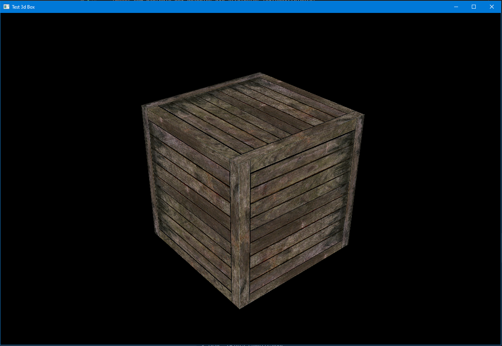

# TestLearnLibGdx



Исследование библиотеки [libGDX](https://libgdx.com/). Программа позволяет вращать куб с помощью мыши и управлять перспективной камерой с помощью колеса мыши.

## Управление

- **Левая кнопка мыши**: Вращение куба по осям ```X,Y```
- **Колесо мыши**: Зум камеры.

## Платформы

- Desktop


